## 📄 페이지별 설명 (weMatch)

---

### 🏠 홈 화면 (HomePage / HomeMatch / HomeMake)

> 프로젝트 탐색 · 유저 탐색 · 프로젝트 생성 진입이 모두 가능한 메인 허브 페이지입니다.
> 
- `HomePage.png`: 로그인한 사용자의 기본 피드 페이지  
  → 좌측 유저카드 / 중앙 추천 프로젝트 / 우측 인기 유저  
- `HomeMatch.png`: 다양한 유저를 탐색하고, 매치 전 프로필 점검을 유도  
  → "내 프로필 점검" 버튼으로 연결  
- `HomeMake.png`: 프로젝트가 없다면 사용자가 직접 시작할 수 있도록 유도  
  → "Make" 버튼으로 ProjectCreate로 이동  

📷  
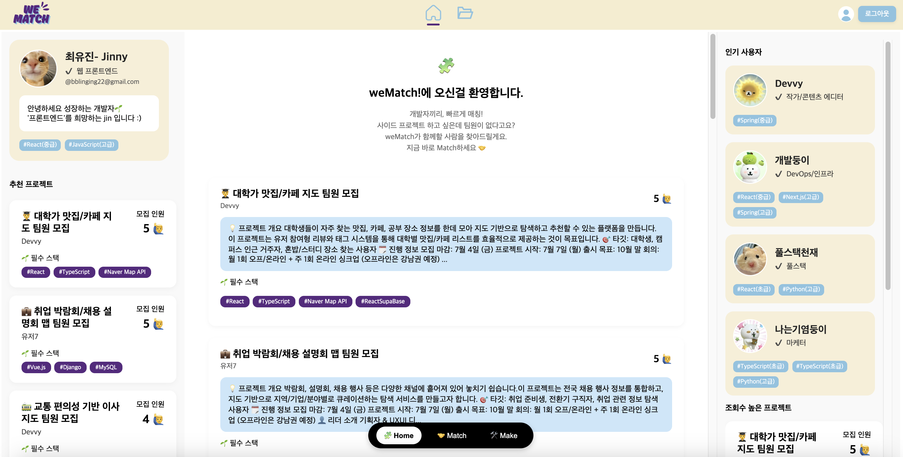  
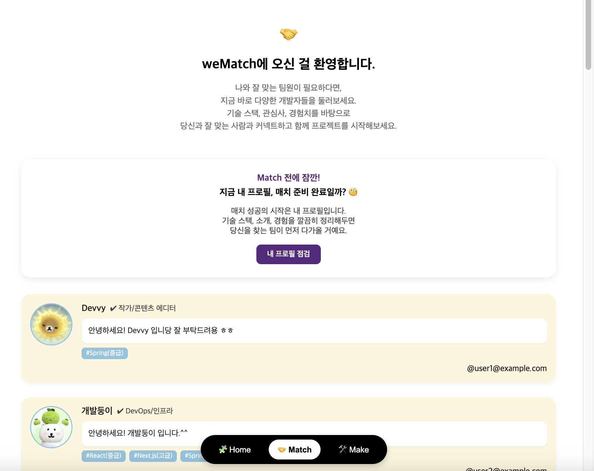  
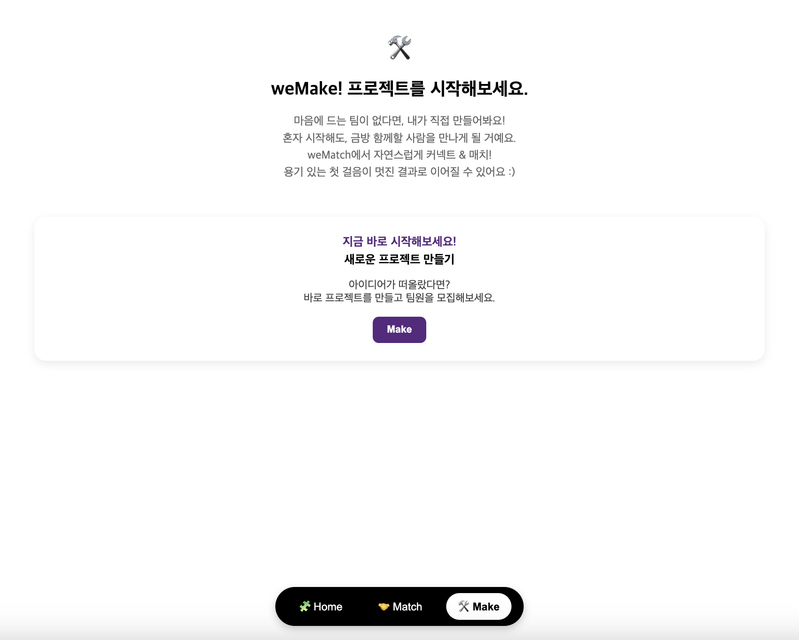

---

### 🔐 인증 화면 (Login / Signup)

> 사용자 인증을 위한 화면입니다. 로그인은 모달, 회원가입은 전체 페이지로 구성됩니다.

- `Login.png`: 이메일/비밀번호 입력 → 로그인 시도  
  → 추후 구글/GitHub 소셜 로그인 버튼도 포함  
- `Signup.png`: 닉네임, 포지션, 기술스택(숙련도 포함)까지 작성 가능  
  → 기술은 태그 형태로 추가  

📷  
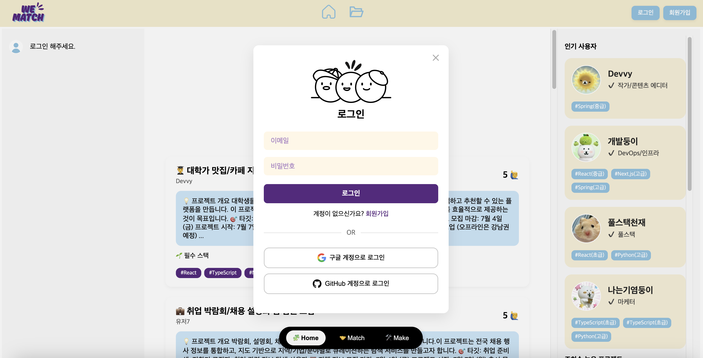  
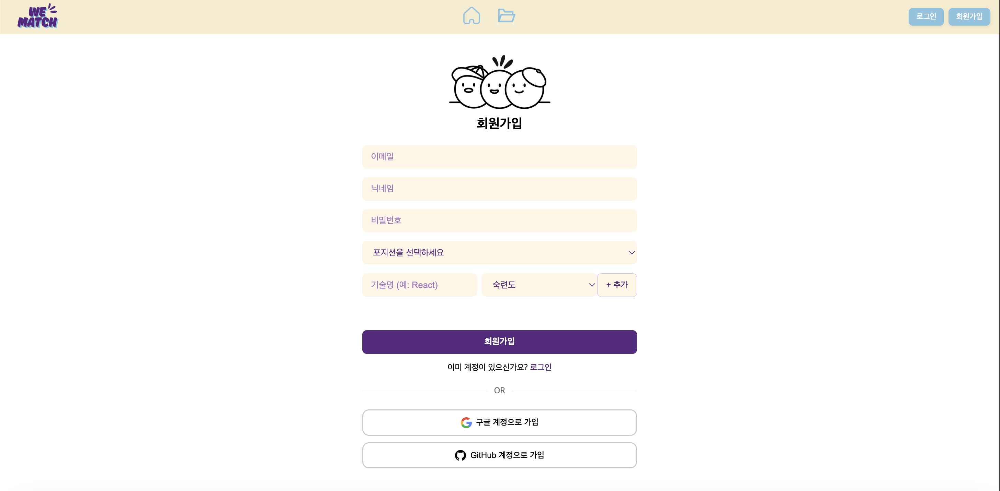

---

### 🙋‍♀️ 프로필 관련 페이지 (MyProfile / ProfileEdit)

> 내 프로필을 조회하거나 수정할 수 있는 공간입니다.

- `MyProfile.png`: 프로필 요약 정보 + 내가 만든/참여/신청한 프로젝트를 탭 형태로 구분  
- `ProfileEdit.png`: 닉네임, 포지션, 기술/언어, 자기소개 수정 가능  

📷  
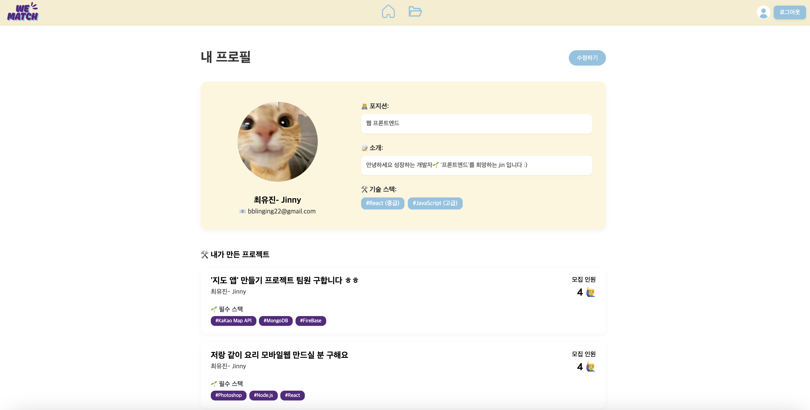  
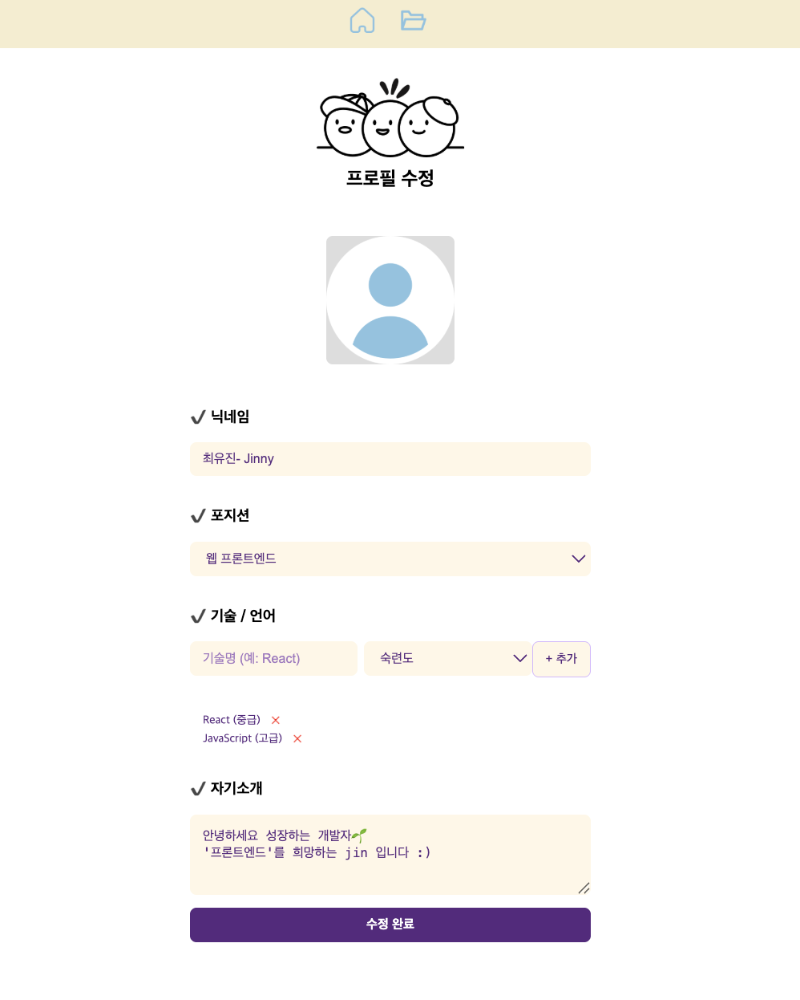

---

### 📁 내 프로젝트 목록 (MyProjectList / MyProjectList2)

> 내가 만든 프로젝트를 확인할 수 있는 공간이며, 상태에 따라 두 종류로 나뉩니다.

- `MyProjectList.png`: 프로젝트가 존재할 경우 리스트가 표시됨  
- `MyProjectList2.png`: 아직 생성한 프로젝트가 없을 경우 안내 메시지만 표시  

📷  
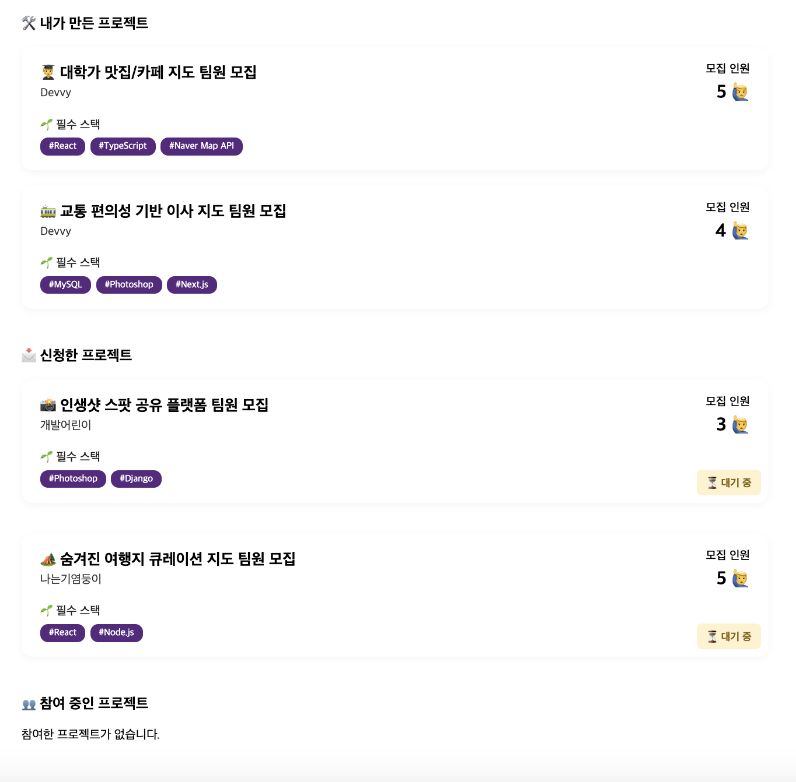  
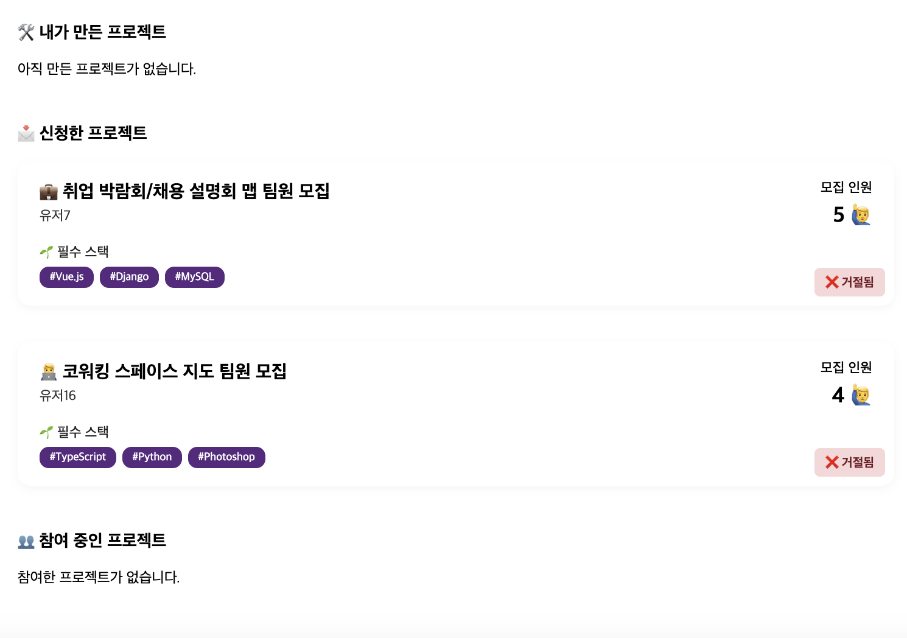

---

### 🔍 프로젝트 탐색 화면 (ProjectPage / ProjectPage2)

> 전체 프로젝트 목록을 탐색하고, 필터링을 통해 원하는 조건의 프로젝트를 찾을 수 있는 페이지입니다.

- `ProjectPage.png`: 전체 프로젝트를 카드 형태로 나열  
- `ProjectPage2.png`: 필터를 통한 조건 검색 후의 상태  

📷  
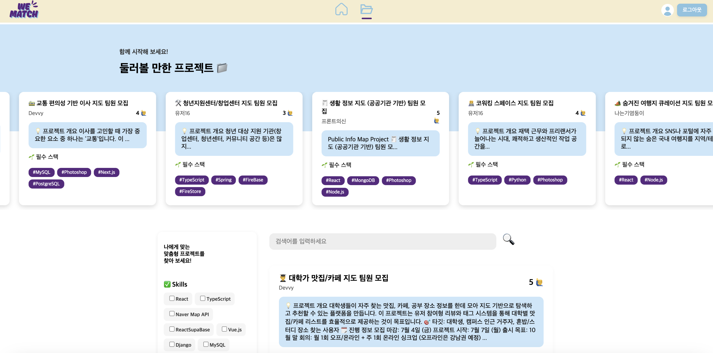  

---

### 📌 프로젝트 상세 화면 (ProjectDetail)

> 프로젝트 개요, 작성자 정보, 모집 인원, 팀원 현황 등을 보여주는 페이지입니다.

- `ProjectDetail.png`:  
  - 좌측은 프로젝트 설명 + 현재 참여 중인 인원  
  - 우측은 작성자 정보  
  - 로그인 사용자에 따라 “신청” 또는 “신청자 관리” UI 분기  

📷  
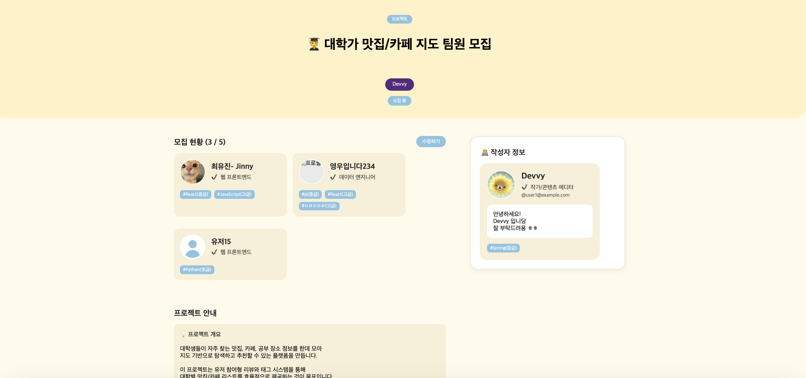

---

### 📝 프로젝트 생성/수정 (ProjectCreate / ProjectEdit)

> 프로젝트를 처음 생성하거나, 기존 프로젝트를 수정하는 화면입니다.  
> 텍스트 필드, 인원 수 조정 버튼, 기술 스택 태그 등을 포함합니다.

- `ProjectCreate.png`: 새로운 프로젝트 등록용  
- `ProjectEdit.png`: 기존 데이터 불러와 수정  

📷  
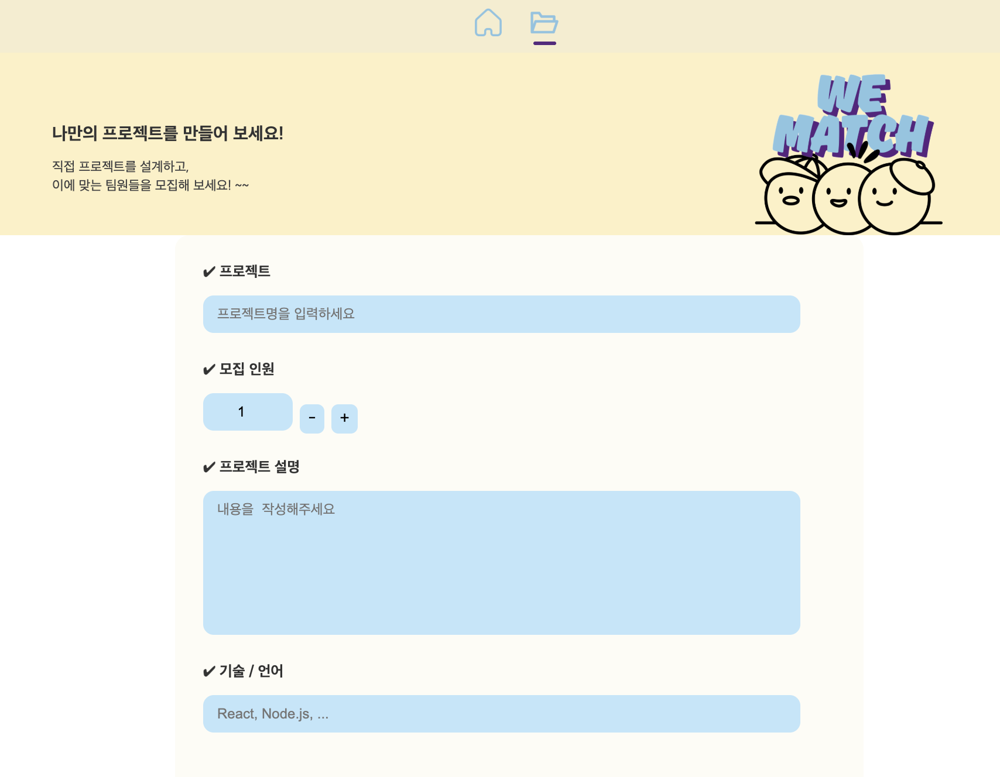  
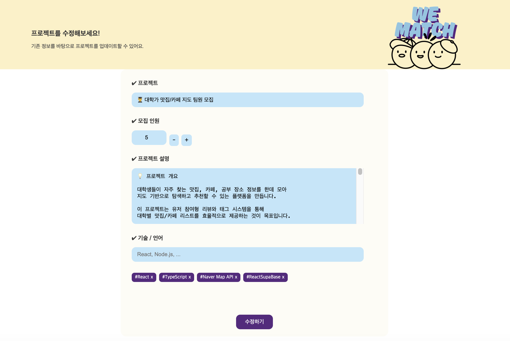

---

### 🙋‍♂️ 프로젝트 신청 관리 (ProjectApply)

> 프로젝트를 만든 작성자가 지원자의 프로필을 보고 수락/거절할 수 있는 화면입니다.

- `ProjectApply.png`: 지원자 리스트 + "+" (수락), "–" (거절) 버튼  

📷  
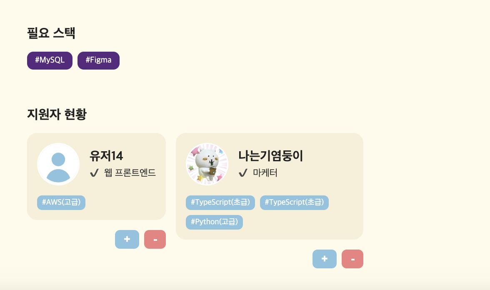
